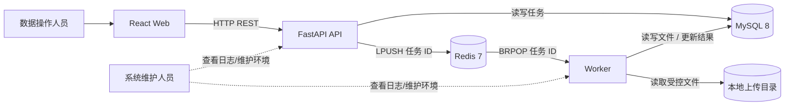
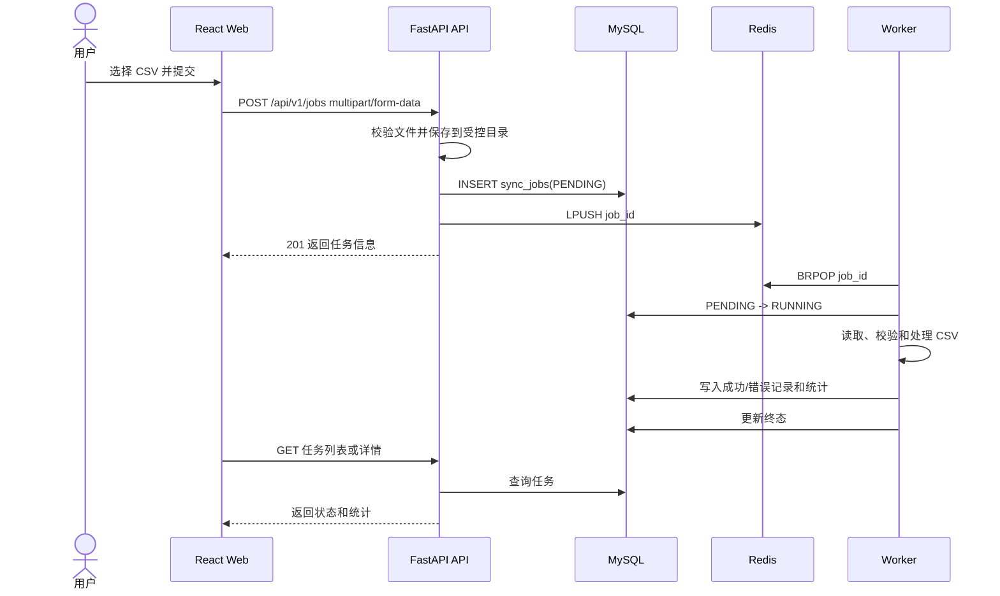

# SyncFlow 系统边界与核心流程

## 系统边界

## 核心流程

## 职责边界

- Web 负责展示和交互，不直接访问 MySQL/Redis。
- API 负责请求校验、文件接收、任务入库和入队，不执行耗时 CSV 处理。
- Worker 负责异步处理和任务状态更新，不接受浏览器请求。
- MySQL 负责持久化任务、成功记录和错误记录。
- Redis 只负责短期任务队列，不作为任务最终事实来源。
